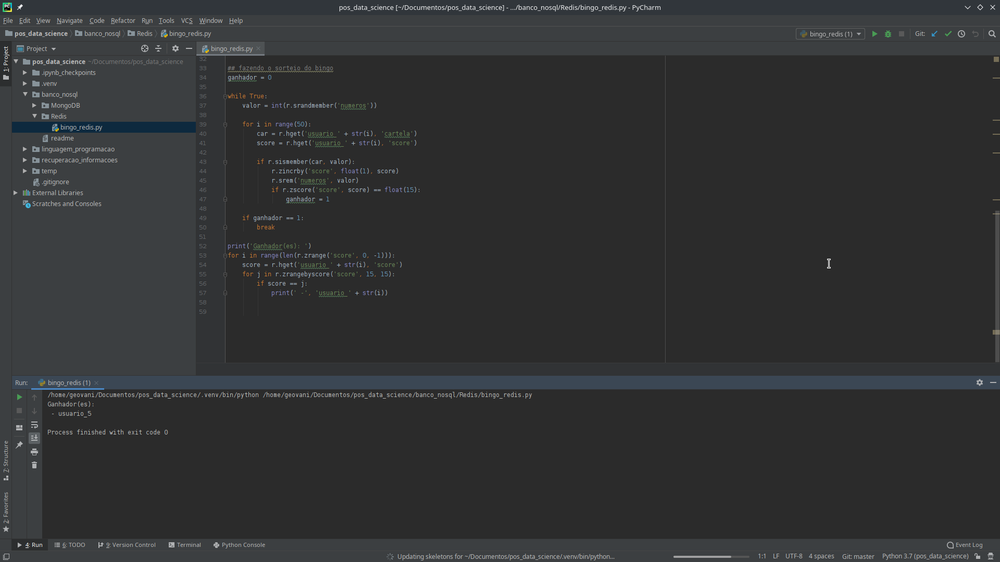

<h1>Redinsgo - Atividade Prática Redis</h1>

Para rodar o codigo é necessário:

- Python versão 3.8.1;

- Ter uma instancia do Redis funcionando localmente;

- Biblioteca do Redis instalada no Python (pip install redis)

<h2>Executando:</h2>
Para executar o Redinsgo basta executar o arquivo bingo_redis.py: </br>

``` terminal
phython bingo_redis.py
```

Após chamar o comando deverá aparecer a seguinte saida no console:


